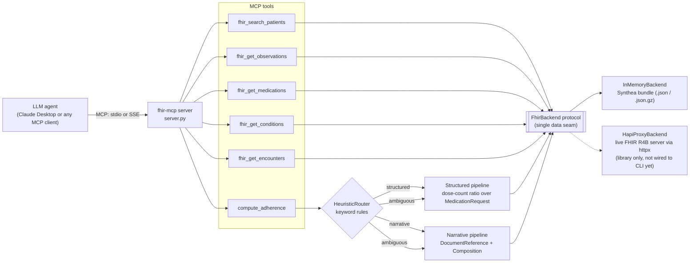

# fhir-mcp

[](https://github.com/TirtheshJani/FHIR-MCP/actions/workflows/ci.yml)
[](LICENSE)
[](pyproject.toml)

**A Model Context Protocol (MCP) server that lets LLM agents such as Claude query FHIR R4B patient records through six typed tools, including a composite medication-adherence tool that routes each question to a structured or a narrative pipeline.**

Ships with a 100-patient synthetic Synthea bundle, so you can connect it to Claude Desktop and ask clinical questions in about five minutes, with no credentials and no real patient data.

## Why

Clinical data lives in two shapes: structured FHIR resources (coded medications, labs, encounters) and free-text narrative (notes, documents). Agents answer some questions better from one and some from the other. A dose-count question ("how many refills in 2020?") wants arithmetic over `MedicationRequest`; an open question ("describe the overall adherence pattern") wants the notes. `fhir-mcp` gives an agent thin, predictable FHIR tools plus one composite tool, `compute_adherence`, that makes that routing decision explicit and inspectable instead of leaving it to prompt luck.

## Architecture



Key design points:

- **One data seam.** Every tool talks to a `FhirBackend` protocol (`read`, `search`). Tools never branch on where data comes from.
- **Thin tools.** The five resource tools are passthroughs that return FHIR R4B JSON. Only `compute_adherence` contains logic.
- **Swappable router.** Routing sits behind a `Router` protocol (`detect(question) -> Intent`), so the keyword heuristic can be replaced without touching the tool.

## Tools

| Tool | Arguments | Returns |
|------|-----------|---------|
| `fhir_search_patients` | `criteria: object` (required; pass `{}` for all) | List of `Patient` resources. The in-memory backend returns all patients and ignores other criteria; the HAPI proxy forwards criteria as FHIR search params. |
| `fhir_get_observations` | `patient_id: string` (required), `code: string` (optional, e.g. LOINC `4548-4`) | `Observation` resources for the patient, optionally filtered by coding code |
| `fhir_get_medications` | `patient_id: string` (required) | `MedicationRequest` resources for the patient |
| `fhir_get_conditions` | `patient_id: string` (required) | `Condition` resources for the patient |
| `fhir_get_encounters` | `patient_id: string` (required) | `Encounter` resources for the patient |
| `compute_adherence` | `patient_id`, `medication`, `question` (all required strings) | `{"branch": "structured" \| "narrative" \| "ambiguous", ...}` with the structured result, the narrative resources, or both |

### How `compute_adherence` routes

Routing today is a transparent **keyword heuristic** (`src/fhir_mcp/adherence/routing.py`), not a trained model:

- **structured** if the question matches only structured cues: "did ... take", "refill", "how many", a month name, or a four-digit year. Runs a dose-count ratio (`observed_doses / expected_doses`) over matching `MedicationRequest` resources.
- **narrative** if it matches only narrative cues: "describe", "summarize", "overall", "pattern". Returns the patient's `DocumentReference` and `Composition` resources for the agent to summarize.
- **ambiguous** otherwise (both or neither). Runs both pipelines and returns both.

The routing split is motivated by a May 2026 preprint by Jani et al. (citation forthcoming), which reports AUC 0.997 for structured-FHIR-wins classification and AUC 0.843 for narrative-wins free-form QA. Those figures describe the preprint's classifier, **not** this heuristic. The trained classifier is not part of this repo yet; the `Router` protocol is the seam where it will plug in (see Roadmap).

## Quickstart

Requires Python 3.11 or 3.12.

> **Note on PyPI:** the name `fhir-mcp` on PyPI currently belongs to a different, unrelated project. Do **not** `pip install fhir-mcp` expecting this server. Install from source as shown below.

### 1. Install

```bash
git clone https://github.com/TirtheshJani/FHIR-MCP.git
cd FHIR-MCP
python -m venv .venv
source .venv/bin/activate        # Windows: .venv\Scripts\activate
pip install -e .
fhir-mcp --version               # fhir-mcp 0.1.0
```

Or run it without a manual venv using [uv](https://docs.astral.sh/uv/), from the clone:

```bash
uvx --from . fhir-mcp --version
```

### 2. Run against the bundled synthetic data

```bash
# stdio (what Claude Desktop uses); the process waits for an MCP client on stdin
fhir-mcp --bundle examples/synthea_patients.json.gz

# or SSE over HTTP for remote clients
fhir-mcp --transport sse --port 8000 --bundle examples/synthea_patients.json.gz
curl -N http://127.0.0.1:8000/sse     # prints "event: endpoint" then a session URL
```

`--bundle` accepts a FHIR `Bundle` as `.json` or `.json.gz`.

### 3. Try it from Python (no Claude Desktop needed)

```python
import asyncio, json
from mcp import ClientSession, StdioServerParameters
from mcp.client.stdio import stdio_client

async def main():
    params = StdioServerParameters(
        command="fhir-mcp", args=["--bundle", "examples/synthea_patients.json.gz"]
    )
    async with stdio_client(params) as (r, w), ClientSession(r, w) as s:
        await s.initialize()
        print([t.name for t in (await s.list_tools()).tools])
        res = await s.call_tool("fhir_search_patients", {"criteria": {}})
        print(len(json.loads(res.content[0].text)), "patients")

asyncio.run(main())
```

Expected output:

```
['fhir_search_patients', 'fhir_get_observations', 'fhir_get_medications', 'fhir_get_conditions', 'fhir_get_encounters', 'compute_adherence']
100 patients
```

### 4. Connect to Claude Desktop

Merge this block (same as [`examples/claude_desktop_config.json`](examples/claude_desktop_config.json)) into your Claude Desktop config:

- macOS: `~/Library/Application Support/Claude/claude_desktop_config.json`
- Windows: `%APPDATA%\Claude\claude_desktop_config.json`

```json
{
  "mcpServers": {
    "fhir-mcp": {
      "command": "python",
      "args": [
        "-m",
        "fhir_mcp",
        "--bundle",
        "/absolute/path/to/synthea_patients.json.gz"
      ]
    }
  }
}
```

Two edits are required:

1. Set `--bundle` to the absolute path of `examples/synthea_patients.json.gz` in your clone.
2. Claude Desktop does not activate your virtualenv, so replace `"python"` with the absolute path to the venv interpreter where you ran `pip install -e .` (for example `/home/you/FHIR-MCP/.venv/bin/python`, or `C:\\Users\\you\\FHIR-MCP\\.venv\\Scripts\\python.exe` on Windows).

Restart Claude Desktop and confirm the six fhir-mcp tools appear in the tools menu.

## Example queries

Against the bundled data (patient IDs are Synthea UUIDs; ask the agent to search first, or use the ID below):

- "How many patients are in the bundle, and what is the gender split?"
- "Find patients with type 2 diabetes." (the agent combines `fhir_search_patients` and `fhir_get_conditions`)
- "Show HbA1c results (LOINC 4548-4) for patient 2c1e5bdb-ccdb-1906-61d2-12fe2d71cd89."
- "How many refills of metformin did that patient have in 2020?" (routes **structured**)
- "Describe that patient's overall metformin adherence pattern." (routes **narrative**)

Verified results for patient `2c1e5bdb-ccdb-1906-61d2-12fe2d71cd89` over stdio: 36 conditions (including "Diabetes mellitus type 2 (disorder)"), 11 HbA1c observations, the refill question routed to `structured`, and the describe question routed to `narrative` with 72 narrative resources. More prompts are in [`examples/demo_queries.md`](examples/demo_queries.md) and a recording walkthrough is in [`docs/DEMO_SCRIPT.md`](docs/DEMO_SCRIPT.md).

## Deployment

- **Docker:** [`docker/Dockerfile`](docker/Dockerfile) builds an image that serves SSE on port 8000 with the bundled data. Multi-arch (`linux/amd64`, `linux/arm64`); CI builds and smoke-tests the arm64 image.
  ```bash
  docker build -f docker/Dockerfile -t fhir-mcp .
  docker run --rm -p 8000:8000 fhir-mcp
  ```
- **TLS + reverse proxy:** [`docker/docker-compose.yml`](docker/docker-compose.yml) adds a Caddy sidecar ([`docker/Caddyfile`](docker/Caddyfile)).
- **Oracle Cloud Always Free (ARM Ampere):** step-by-step runbook in [`docs/DEPLOY_ORACLE.md`](docs/DEPLOY_ORACLE.md).

The SSE endpoint has no authentication. Only expose it with synthetic data, or put it behind your own auth.

## Development

```bash
pip install -e ".[dev]"
ruff check .
ruff format --check .
mypy            # strict, over src/fhir_mcp
pytest -q
```

CI ([`.github/workflows/ci.yml`](.github/workflows/ci.yml)) runs the same four commands on `ubuntu-latest` and `ubuntu-24.04-arm` for Python 3.11 and 3.12, plus an arm64 Docker build and SSE smoke test. See [`CONTRIBUTING.md`](CONTRIBUTING.md).

Project layout:

```
src/fhir_mcp/
  __main__.py          CLI: --bundle, --transport {stdio,sse}, --port, --version
  server.py            MCP server, tool registration, SSE app
  backend/             FhirBackend protocol, InMemoryBackend, HapiProxyBackend
  tools/               one module per FHIR resource tool
  adherence/           compute_adherence: router, structured and narrative pipelines
scripts/               Synthea generation, R4 to R4B conversion, bundle validation
examples/              bundled synthetic data, Claude Desktop config, demo queries
```

## Status and roadmap

**v0.1.0 (done)**

- Five FHIR R4B resource tools and the composite `compute_adherence` tool with a keyword `HeuristicRouter`.
- `InMemoryBackend` (Synthea bundle) and `HapiProxyBackend` (library API, optional `proxy` extra).
- stdio and SSE transports, `--version` flag, Docker image, Oracle ARM runbook, CI on x86 and ARM.

**Known limitations**

- The bundled Synthea `MedicationRequest` resources carry no `dispenseRequest.quantity`, so the structured pipeline reports `observed_doses: 0` and `adherence_ratio: 0.0` on this data. The ratio is meaningful only for data that records dispense quantities.
- Medications referenced through a separate `Medication` resource (rather than an inline code) are not matched by name in the structured pipeline.
- `HapiProxyBackend` is not selectable from the CLI yet; the CLI always loads a local bundle.
- Not yet published to PyPI under its own name (see the note in Quickstart).

**v0.2.0 (planned, see [`docs/superpowers/plans/2026-05-18-fhir-mcp-v0.2.0.md`](docs/superpowers/plans/2026-05-18-fhir-mcp-v0.2.0.md))**

- Opt-in `ClassifierRouter` behind the existing `Router` protocol, selected with `FHIR_MCP_ROUTER=classifier`. Blocked on the trained classifier artifact, which does not exist in this repo yet. The heuristic stays the default.
- Structured logging with `structlog` and a `/health` route on the SSE app.
- PyPI release and MCP registry listing.

## Data and PHI

All bundled and test data is **synthetic**, generated with [Synthea](https://github.com/synthetichealth/synthea) and converted to FHIR R4B. It contains no real patient information. **Never** point this server at real protected health information (PHI): it has no authentication, access control, or audit logging. See [`SECURITY.md`](SECURITY.md).

## Citation

If you use this software, see [`CITATION.cff`](CITATION.cff).

## License

MIT. See [`LICENSE`](LICENSE).

## Author

Tirthesh Jani
